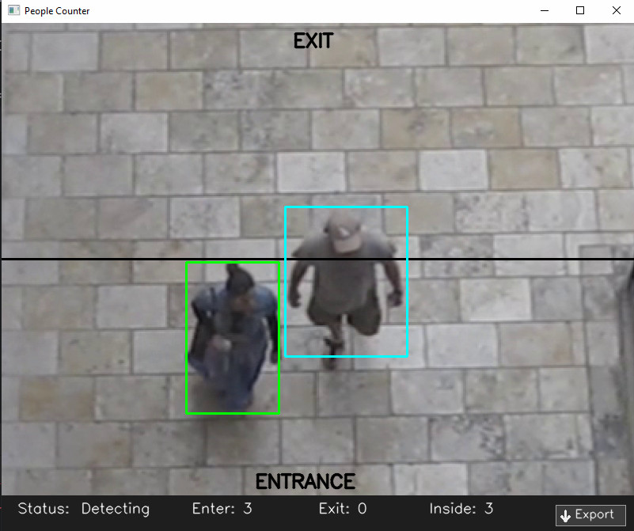
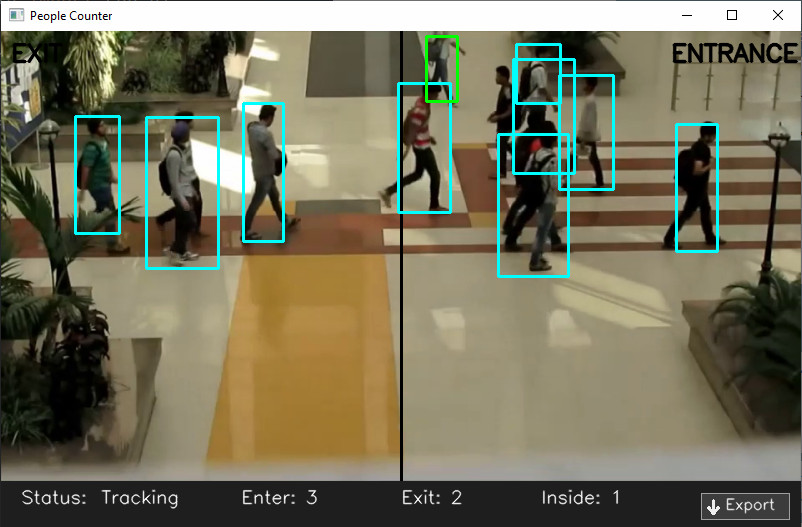
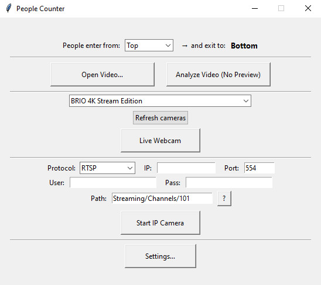
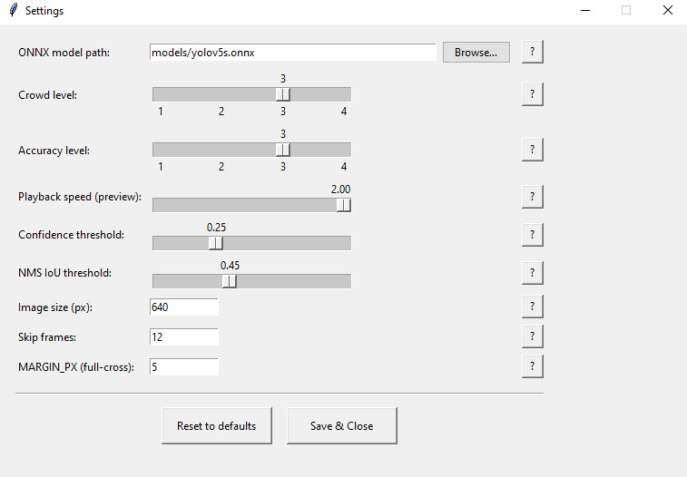

# People Counter

A **People Counting Application** using **YOLOv5 (ONNX)** and **OpenCV**.  
Detects, tracks, and counts people entering/exiting an area from video files, webcams, or IP cameras.

---

## ✨ Features
- Input sources: **Video files**, **Local webcam**, **IP cameras (RTSP/HTTP)**
- Direction-aware counting (Top↔Bottom, Left↔Right)
- **Headless Analyze** mode with auto **Save as Excel/CSV**
- Live preview HUD (enter / exit / inside)
- Robust “armed-after-start” logic → avoids false counts when an object appears on the midline at t=0
- Simple **Settings** panel (sliders + advanced fields)
- CSV/Excel export to `data/exports/`

---

## 🖼 Example Screenshots

### Live Detection & Counting



### Main UI


### Settings Panel


> Place these screenshots under a new folder called `images/` in your repository.

---

## 🛠 Requirements
- Python **3.9+**
- Install dependencies:
```bash
pip install -r requirements.txt
```

Model file:
- Default model included: `models/yolov5s.onnx` (COCO pretrained, person class only).

---

## 🚀 Usage
Start the UI:
```bash
python main.py
```
- **Open Video…** → Live preview with HUD  
- **Analyze Video (No Preview)** → Offline analysis, ends with **Save As** dialog (Excel/CSV)  
- **Live Webcam / Start IP Camera** → Preview from camera

**Hotkeys (preview window):**
- `q` → Quit
- `e` → Export report (same as clicking the Export button)

---

## ⚙️ Settings Guide
(unchanged, as in previous version…)

---

## 🧪 Experimental Results
(unchanged, as in previous version…)

---

## 📜 License
MIT License. Free to use and modify.
